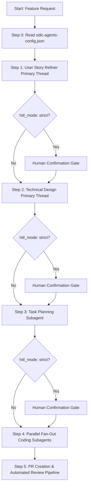
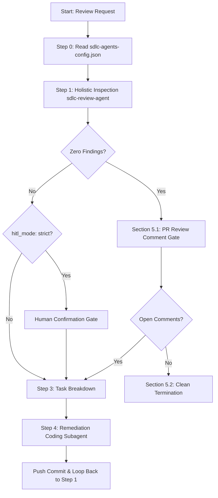

# Agentic SDLC Workflows

This repository provides a standardized, agent-driven Software Development Lifecycle (SDLC) framework operating in a **Human-Over-The-Loop (HOTL)** paradigm. It empowers engineering teams and AI coding assistants to collaboratively plan, implement, review, and self-heal codebases with maximum speed, rigor, and architectural consistency.

---

## Human-Over-The-Loop (HOTL) Paradigm

In standard autonomous agent frameworks, AI operates entirely in the loop or unsupervised, often leading to architectural drift, speculative over-engineering, and unverified assumptions. 

The **Human-Over-The-Loop (HOTL)** framework addresses this by pairing autonomous AI execution for high-velocity routine work (planning, fan-out coding, testing, inspection) with explicit human oversight and approval gates at critical transition milestones:
- **Ambiguous or Incomplete Requirements**: Agents pause and request targeted clarification before generating designs or code.
- **Architectural & Technical Design Gates**: Human leads review and confirm user stories and RFCs before implementation begins.
- **Security & Permissibility Verification**: Critical operations, dependency installations, and remediation loops remain bounded by human-configurable oversight.

---

## Architecture & Executive Workflows

The framework divides software delivery into two primary, standardized pipelines governed by configurable Human-Over-The-Loop confirmation gates.

### 1. Implementation Pipeline (`workflows/SDLC_IMPLEMENT_WORKFLOW.md`)
Orchestrates end-to-end feature delivery from informal requests through structured requirements refinement, task breakdown, parallel fan-out coding, and automated PR verification.



### 2. Self-Healing Review Pipeline (`workflows/SDLC_REVIEW_WORKFLOW.md`)
Executes rigorous, multi-pillar inspection and automated self-healing remediation loops on pull requests and code modifications until zero issues remain.



---

## The 4 Holistic Review Pillars

When evaluating code changes or running the review pipeline (`workflows/SDLC_REVIEW_WORKFLOW.md`), agents strictly inspect target code against **4 Holistic Review Pillars**:

1. **Bugs & Logic Flaws**
   - Identification of edge case failures, off-by-one errors, race conditions, null/undefined pointer dereferences, unhandled exceptions, and algorithmic correctness.
2. **Security Vulnerabilities**
   - Detection of injection flaws (SQLi, XSS, OS Command Injection), insecure authentication/authorization, sensitive data exposure, and hardcoded secrets or credentials.
3. **Architectural Consistency (Karpathy 4 Principles)**
   - Enforcing Andrej Karpathy's disciplined coding principles across all changes:
     - *Think Before Coding*: Explicit assumption mapping and concrete verification planning prior to execution.
     - *Simplicity First*: Writing the absolute minimum code required to solve the request; zero speculative over-engineering or unused abstractions.
     - *Surgical Changes*: Modifying only exact target lines without accidental whole-file rewrites or reformatting stable code.
     - *Goal-Driven Execution*: Closing the execution loop with verifiable test outcomes.
4. **TDD Compliance**
   - Verifying that code changes adhere to Test-Driven Development (TDD) best practices: failing tests written prior to implementation, minimal passing implementations, and clean regression test suites.

---

## Configuration Quickstart

The framework behavior across pipelines is controlled centrally via `sdlc-agents-config.json` placed in your repository root.

### Example `sdlc-agents-config.json`
```json
{
  "artifact_tracking_mode": "local",
  "hitl_mode": "strict"
}
```

### Configuration Parameters
- **`artifact_tracking_mode`**: Determines where user stories, technical designs, and task artifacts are saved.
  - `"local"`: Saves markdown artifacts directly inside `.agent_artifacts/` in the workspace root.
  - `"github"`: Tracks user stories and technical designs directly as GitHub Issues.
  - `"gitlab"`: Tracks artifacts directly as GitLab Issues.
- **`hitl_mode`**: Controls the strictness of Human-In-The-Loop / Human-Over-The-Loop approval gates.
  - `"strict"`: Enforces explicit human confirmation gates before advancing across major phases (e.g., between User Story Refinement, Technical Design, and Coding).
  - `"autonomous"`: Advances automatically through pipeline stages without blocking for human confirmation unless clarification is explicitly needed.
  - `"exception_only"`: Operates autonomously but pauses execution and prompts for human intervention if critical architectural drift, verification failures, or high-severity security vulnerabilities occur.

---

## AI Onboarding Quickstart

To install and adopt the SDLC HOTL framework into any external project or repository, point your developers and AI assistants (e.g., Antigravity, Claude Code, Cursor, Codex) to our specialized guides:

1. **Setup & Installation**: Refer to **[INSTALL.md](INSTALL.md)** for workspace overlay commands (`git clone`, `cp`) and tool configuration templates (`CLAUDE.md`, `.cursorrules`, etc.).
2. **Runtime Governance & Operational SOP**: Refer to **[AGENTS.md](AGENTS.md)** as the authoritative single source of truth for workflow routing rules and standard operating procedures during active development sessions.

---

## Directory Structure Overview

- `agents/` — Declarative pure Markdown instruction specifications for specialized roles (`sdlc-user-story-refiner`, `sdlc-technical-designer`, `sdlc-task-planner`, `sdlc-coding-agent`, `sdlc-review-agent`).
- `skills/` — Shared capabilities and utilities (e.g., `artifacts-skill` for routing output artifacts).
- `workflows/` — Standard operating procedures governing multi-agent implementation (`SDLC_IMPLEMENT_WORKFLOW.md`) and review (`SDLC_REVIEW_WORKFLOW.md`).
- `schemas/` — JSON schemas validating configuration and task definitions.
