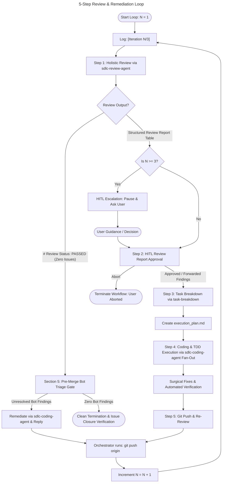

# Automated SDLC Review and Remediation Workflow

This document defines the Standard Operating Procedure (SOP) for the orchestrator agent to execute an automated, self-healing code review and remediation loop using specialized subagents.

**To execute this workflow, the user should instruct the orchestrator agent:** 
*"Execute the review and remediation workflow defined in workflows/SDLC_REVIEW_WORKFLOW.md for current branch against origin/main."*

---

## 0. Prerequisite Check & Configuration Loading

Before starting the workflow, the orchestrator agent MUST load the central configuration at the repository root:
1. **Read Configuration**: Use `view_file` to read `sdlc-agents-config.json`.
2. **Extract Governance & Tracking Parameters**: Note `hitl_mode` (`"strict"`, `"autonomous"`, `"exception_only"`) and `artifact_tracking_mode` (`"local"`, `"github"`, `"gitlab"`).
3. **Initialize/Load State Checkpoint**: Initialize or load `.agent_artifacts/SDLC_STATE.md` to track current workflow status, active review findings, and loop iteration checkpoints.

## 1. Agent Initialization & Prompts

Before commencing the review loop, the orchestrator agent MUST read the central configuration and load the required subagent prompt definitions and skills from the repository and register them dynamically.

1. **Load Configuration, Skills, and Prompts**: Use `view_file` to read instructions and configuration from:
   - `sdlc-agents-config.json` (Extract `artifact_tracking_mode` and `hitl_mode` configuration parameters)
   - `agents/sdlc-review-agent/INSTRUCTION.md` (Holistic review instructions and table output formats)
   - `skills/artifacts-skill/SKILL.md` (Artifact tracking and output routing rules)
   - `agents/sdlc-task-planner/INSTRUCTION.md` (Task breakdown and execution planning)
   - `agents/sdlc-coding-agent/INSTRUCTION.md` (Surgical TDD code implementation)
2. **Register Subagents**: Use the `define_subagent` tool to register three subagents for the session:
   - `sdlc-review-agent`: Configured with the holistic review skill instructions to inspect diffs and evaluate code across 4 pillars. Mandate that `sdlc-review-agent` runs in an isolated clean-room sandbox with zero shared history or author bias (AC1). Register `sdlc-review-agent` with command execution capabilities (`enable_write_tools=True`) so it can execute verification suites and Git CLI commands (AC2). Note that `sdlc-review-agent` follows `skills/artifacts-skill/SKILL.md` to output findings (either posting line-item comments directly on a Pull Request via MCP tools or saving to `.agent_artifacts/review_report.md` when running locally/fallback).
   - `task-breakdown` (or `sdlc-task-planner`): Configured with task planning instructions to translate structured review reports into developer tasks.
   - `sdlc-coding-agent`: Configured with the coding instructions and Karpathy engineering principles (`enable_write_tools=True` so it can edit files and run verification test commands).

**Security & Sandbox Constraint (AC3)**: Subagents are explicitly prohibited from accessing raw internal files in `.git/` (e.g., direct file edits or reads in `.git/objects`, `.git/config`, etc.). All repository interactions MUST use standard Git CLI commands or appropriate tooling.

---

## 2. Circuit Breaker & Logging Protocol

To prevent infinite remediation loops on intractable bugs or architectural deadlocks, the orchestrator agent enforces a strict **Circuit Breaker Safeguard**:
- **Maximum Iteration Threshold**: Default maximum of **3 iterations** (`max_iterations = 3`).
- **Iteration Tracking**: Maintain an explicit iteration counter `N`, initialized at `1`.
- **Status Logging**: At the beginning of each loop iteration, the orchestrator MUST log a clear status banner indicating the current progress:
  ```
  [Iteration N/3] Starting SDLC Review & Remediation Cycle...
  ```
- **State Checkpoint Tracking**: At the start of each iteration, record the iteration count (`Iteration N/3`) and circuit breaker status (`ACTIVE` or `EXHAUSTED`) in `.agent_artifacts/SDLC_STATE.md`.

---

## 3. The 5-Step Remediation Loop

The orchestrator agent executes the automated review and remediation loop sequentially as follows:



### Step 1: Holistic Review via `sdlc-review-agent`
- **Action**: Invoke the `sdlc-review-agent` subagent in an isolated clean-room sandbox (zero shared history or author bias).
- **Input / Command**: Instruct the agent to inspect the target changes against the base branch (`git diff origin/main...HEAD`) and run verification suites as needed. If `artifact_tracking_mode` is `"github"` or `"gitlab"`, the review MUST operate directly on the existing Pull Request. If `artifact_tracking_mode` is `"local"`, the review runs directly on the local files.
- **Evaluation**: The agent evaluates all modifications against the 4 Holistic Pillars (Bugs & Logic Flaws, Security Vulnerabilities, Architectural Consistency, and TDD Compliance).
- **Output Artifact & Routing**: Note that `sdlc-review-agent` follows `skills/artifacts-skill/SKILL.md` to output findings (if a Pull Request exists for `github`/`gitlab`, post line-item review comments directly on the PR via MCP tools; if `local`, save findings to `.agent_artifacts/review_report.md`).
- **Decision Fork**:
  - If `sdlc-review-agent` outputs the clean termination banner `# Review Status: PASSED (Zero Issues)`, immediately **exit the remediation loop** and proceed to **Section 5 (Pre-Merge Automated Bot Triage Gate & Clean Termination)**.
  - If `sdlc-review-agent` outputs a structured Markdown **Review Report Table** detailing findings (`REV-001`, `REV-002`, etc.), advance to Step 2 (**HITL Review Report Approval**). DO NOT immediately invoke `task-breakdown`.
- **State Checkpoint Tracking**: Record the active review findings table in `.agent_artifacts/SDLC_STATE.md` and update the phase checkpoint across Steps 1–5.

### Step 2: HITL Review Report Approval (HITL Autonomy Pacing - AC9)
- **Action**: Inspect the `hitl_mode` parameter loaded from `sdlc-agents-config.json`:
  - **`strict`**: Pause automated execution and present the structured Review Report Table to the user via interactive prompt (`ask_user`).
  - **`autonomous` or `exception_only`**: Automatically forward verified findings directly to Step 3 (**Task Breakdown via `task-breakdown`**) without pausing, unless circuit breaker thresholds (`N >= 3`) or blocking architectural trade-offs trigger interactive escalation (Section 4).
- **User Review Options (`strict` mode)**: The user reviews the findings and can:
  1. **Approve All**: Approve all findings for remediation.
  2. **Filter / Dismiss**: Filter out or dismiss specific false positives or unwanted findings.
  3. **Abort**: Abort the review workflow.
- **Outcome**:
  - If approved/filtered (in `strict` mode) or automatically forwarded (in `autonomous` / `exception_only` mode), the verified findings are passed to Step 3 (**Task Breakdown via `task-breakdown`**).
  - If aborted, immediately terminate the workflow.

### Step 3: Task Breakdown via `task-breakdown`
- **Action**: Invoke the `task-breakdown` (or `sdlc-task-planner`) subagent.
- **Input**: The user-approved (or filtered) structured Review Report Table from Step 2.
- **Goal**: Ingest the review findings and decompose them into an actionable developer execution plan (`execution_plan.md`), organizing fixes into logical, non-conflicting task units with clear acceptance criteria and verification commands.
- **Output Artifact**: Updated or newly created `execution_plan.md`.

### Step 4: Coding & TDD Execution via `sdlc-coding-agent` Fan-Out
- **Action**: Invoke `sdlc-coding-agent` instances to implement the fixes defined in `execution_plan.md`.
- **Fan-Out Execution**:
  - For independent findings operating on separate files or isolated modules, fan out multiple instances of `sdlc-coding-agent` concurrently.
  - For dependent or overlapping findings, execute `sdlc-coding-agent` sequentially.
- **Surgical Discipline**: Each `sdlc-coding-agent` MUST strictly abide by Karpathy coding principles:
  1. *Think Before Coding*: Formulate assumptions and test plans before editing.
  2. *Simplicity First*: Make minimal, direct fixes without over-engineering.
  3. *Surgical Changes*: Modify only target lines required to remediate the specific finding.
  4. *Goal-Driven Execution*: Run automated unit/integration tests to verify that the bug or vulnerability is resolved and no regressions occurred.

### Step 5: Git Push & Re-Review
- **Local Verification**: Once all fan-out `sdlc-coding-agent` tasks report successful local verification, the orchestrator verifies git workspace status (`git status`).
- **Orchestrator Git Push**: The orchestrator agent executes git commit (if needed for final coordination) and pushes the remediated branch to the remote repository:
  ```bash
  git push origin <current-branch>
  ```
- **Loop Advance**: Increment the iteration counter (`N = N + 1`) and loop back to **Step 1** to perform a fresh re-review on the pushed commit against `origin/main`.

---

## 4. Human-In-The-Loop (HITL) Interactive Escalation

Automated execution MUST pause immediately, transition state to `WAITING_FOR_CLARIFICATION`, and prompt the user for interactive guidance (`ask_user`) under either of the following explicit triggers:

1. **Circuit Breaker Exhaustion**:
   - **Trigger**: When the iteration counter reaches the maximum threshold (`N = 3`) and Step 1 review still reports unresolved findings rather than `# Review Status: PASSED (Zero Issues)`.
   - **Protocol**: Present a concise summary of persistent findings (`REV-XXX`), outline what failed across previous attempts, and ask the user whether to override the circuit breaker (`N = N + 1`), provide guidance on manual remediation, or abort the workflow.

2. **Architectural Trade-Offs & Blocking Ambiguities**:
   - **Trigger**: At any phase (Review, HITL Approval, Breakdown, or Coding) where an agent identifies conflicting requirements, ambiguous business rules, missing architectural specifications, or high-risk trade-offs (e.g., breaking API changes or database schema alterations).
   - **Protocol**: Immediately halt automated fan-out, detail the specific trade-off or ambiguity, present clear options with pros/cons, and require explicit user sign-off before writing or modifying code.

---

## 5. Pre-Merge Automated Bot Triage Gate & Clean Termination

When `sdlc-review-agent` reports `# Review Status: PASSED (Zero Issues)`, before declaring final workflow completion, the orchestrator agent MUST execute pre-merge verification gates:

### 5.1 Pre-Merge PR Review Comment Triage Gate (AC4)
If `artifact_tracking_mode` indicates external pull request tracking (`github` or `gitlab`):
1. **Fetch Review Comments**: The orchestrator MUST invoke `pull_request_read` to fetch all open pull request review comments on the feature branch.
2. **Inspect Human & Bot Findings**: Inspect all comments for unresolved review feedback. You MUST prioritize human reviewer comments and feedback first, while also inspecting recommendations from automated code review bots (such as `gemini-code-assist`).
3. **Triage and Remediate**: If human reviewers or automated review bots have open actionable findings:
   - Check the circuit breaker: if `N >= 3`, trigger HITL Escalation (Section 4) instead of looping.
   - Triage the comments (prioritizing human feedback) and formulate actionable tasks for remediation.
   - Invoke `sdlc-coding-agent` to implement surgical fixes and verify via automated tests.
   - Reply to the resolved comment threads using `add_reply_to_pull_request_comment`.
   - Push the remediation commit (`git push origin <branch>`) and loop back to **Step 1** to re-run the full review cycle.

### 5.2 Clean Termination & Issue Closure Safeguard (AC5)
The automated workflow completes successfully when `sdlc-review-agent` reports zero issues AND the Pre-Merge Automated Bot Triage Gate passes with zero unaddressed bot findings. Upon reaching clean termination:
1. **Orchestrator Wrap-Up**:
   - Log completion of the review and remediation pipeline.
   - Summarize total iterations completed (`N`), all remediated findings, and modified files pushed to remote.
   - Confirm that the feature branch is clean, verified, and ready for merge into `main`.
   - Set status in `.agent_artifacts/SDLC_STATE.md` to `COMPLETED` and retain the state file for post-review auditing.
2. **Pull Request Closure & Finalization**:
   - If `artifact_tracking_mode` is `"github"` or `"gitlab"`, once the review completes with zero open issues or unaddressed comments, close (or merge) the Pull Request.
3. **Issue Closure Safeguard (AC5)**:
   - To prevent premature ticket closures during ongoing review or PR lifecycle stages, the orchestrator MUST verify that the pull request has been successfully merged/closed into `main` before executing any final issue closure updates (`issue_write` setting issue status to closed).
   - If the PR is verified and approved but not yet closed or merged into `main`, leave linked issues open and report that the PR is ready for merge/closure.
